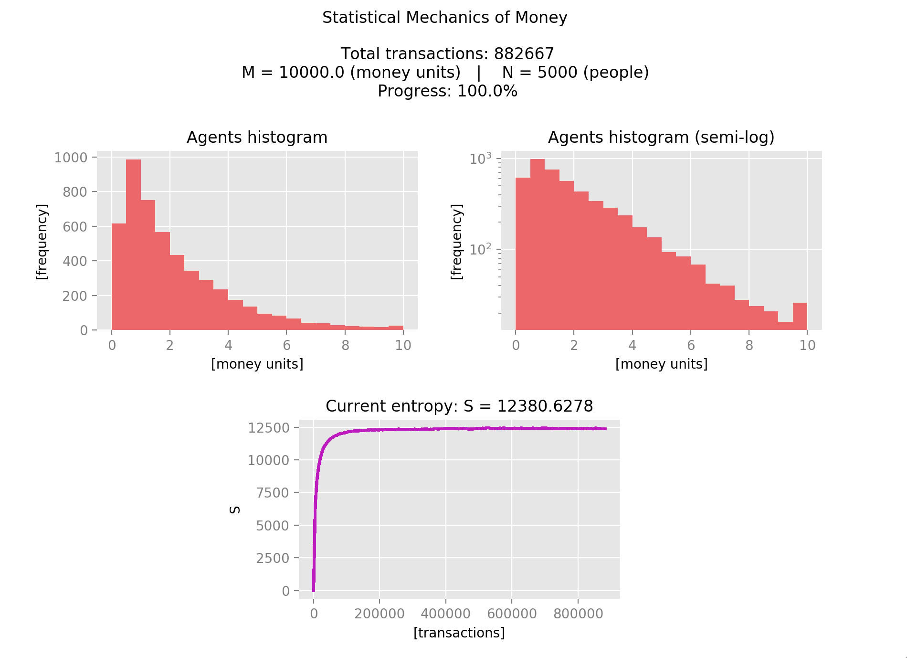

# Mechanical Statistics of Money

## Ejercicio 1
### i)
El sistema simulado cuenta con 5000 agentes y 10000 unidades de dinero.  Se utilizaron 2 clases y se hizo un corte como cantidad de dinero máxima para el histograma de 10 unidadesde dinero.  En cada transacción de intercambiaron 0.5 unidades de dinero.

Primero veremos el caso de distribución inicial Delta de Dirac.  Al converger el sistema,la entropía tiene un valor de S = 12381.

<!--- checa pag 75 del daijiro --->

*Fig. 1: Fin del proceso para sistema con distribución inicial Delta de Dirac y $\Delta m = 0.5$.*

Ahora modificamos el valor de la clase máxima sera de 8 unidades de dinero.

*Fig. 2: Fin del proceso para sistema con distribución inicial Delta de Dirac y $\Delta m = 0.25$.*

Observamos que el valor de entropía fue afectado por este cambio, siendo ahora de S = 12574.

Ahora veremos el caso de distribución inicial uniforme. Al converger el sistema, la entropía tiene un valor de S = 18241.

*Fig. 3: Fin del proceso para sistema con distribución inicial Delta de Dirac y $\Delta m = 0.5$.*

Ahora modificamos el valor de la clase máxima sera de 8 unidades de dinero.

*Fig. 4: Fin del proceso para sistema con distribución inicial Delta de Dirac y $\Delta m = 0.25$.*

Observamos que el valor de entropía fue afectado por este cambio, siendo ahora de S = 13051.

### ii)

Primero presentamos la evolución del sistema con distribución delta de Dirac con los mismos valores de dinero, agentes y clases con clase máxima igual a 10.

*Fig. 5: Screenshot del inicio de simulación.*

*Fig. 6: Screenshot poco después de empezar. Observamos un rápido cambio del sistema.*

*Fig. 7: Screenshot a mitad del proceso. Para ahora el sistema casi converge.*

*Fig. 8: Fin del proceso.*

Ahora presentamos la evolución de un sistema con distribución uniforme para los mismos valores pero ahora con clase máxima de 4 unidades de dinero. 

*Fig. 9: Screenshot del inicio de simulación.*

*Fig. 10: Screenshot poco después de empezar. Observamos un rápido cambio del sistema.*

*Fig. 11: Screenshot a mitad del proceso. Para ahora el sistema casi converge.*

*Fig. 12: Fin del proceso.*

Observamos que la entropía en este caso es un poco más errática. El comportamiento irregular que presenta se debe a que hay varios agentes que están sobrepasando la clase máxima definida y por lo tanto esas frecuencias no se están tomando en cuenta para el calculo de la entropía.

### iii)

Para los sistemas mostrados hemos utilizado una $\Delta m = 0.5$ (unidades de dinero). Ahora utilizaremos $\Delta m = 0.25$ para la distribución inicial delta de Dirac con el resto de los parámetros de sistema sin cambiar.

*Fig. 13: Sistema a comparar que utiliza $\Delta m = 0.5$.*

*Fig. 14: Sistema que utiliza $\Delta m = 0.25$.*

Observamos que para la misma cantidad de transacciones, la entropía en el sistema con $\Delta m = 0.25$ es menor y en general convergió más lentamente que el sistema con $\Delta m = 0.5$.

Ahora haremos lo mismo para el sistema con distribución inicial uniforme.

*Fig. 15: Sistema a comparar que utiliza $\Delta m = 0.5$.*

*Fig. 16: Sistema que utiliza $\Delta m = 0.25$.*

Observamos de nuevo que en el caso con $\Delta m = 0.25$ el sistema converge más lentamente. De igual forma, la entropía también es errática como en el caso $\Delta m = 0.5$.

### iv)

*Fig. 17: Comparación de entropías para distribuciones iniciales uniforme y delta de Dirac.*

Vemos que para los cuatro casos, las distribuciones iniciales uniformes obtienen una mayor entropía que las Deltas de Dirac. Igualmente vemos que las entropías para los casos uniformes empieza desde un valor mayor que cero, mientras que en el caso de la Delta de Dirac se inicia de cero.
            
        
En particulas es interesante observar que en el caso de distribución inicial uniforme, aquella simulación con $\Delta m = 0.25$ tiene una entropía mayor que con $\Delta m = 0.5$. En el caso de distribución incial Delta de Dirac es al revés, pues en el caso $\Delta m = 0.25$ la entropía es menor que en el caso $\Delta m = 0.5$.

En ambos casos de distribución inicial el sistema convergió más rápidamente para $\Delta m = 0.5$.

## Ejercicio 2

Para los siguientes casos se vuelve a utilizar un valor de clase máxima de 10 para la distribución inicial Delta de Dirac y 4 para la distribución inicial uniforme.

### a)

Ahora se muestran las simulaciones con la siguiente función de bienestar

$$
O(n_1,n_2,...,n_C) = \sum n_k o_1(M_k)
$$
$$
o_1(M) = aM
$$

*Fig. 18: Fin del proceso para sistema con distribución inicial Delta de Dirac.*

*Fig. 19: Fin del proceso para sistema con distribución inicial uniforme.*

Como con la entropía, vemos que la función de bienestar es más errática para el caso de distribución inicial uniforme que para la Delta de Dirac. Observamos que al avanzar el tiempo el bienestar general de la sociedad disminuye. 
            
En el caso de distribución Delta de Dirac esto sucede porque en un inicio todos los agentes tenían equidad económica y posteriormente una parte importante de la población tiene poca riqueza en comparación con las clases más altas.
            
En el caso de distribución Delta de Dirac esto sucede porque en un inicio aunque la brecha económica entre la primera y la última clase sea grande, conforme evoluciona el sistema el número de personas en las primeras clases aumenta.

### b)

Ahora se muestran las simulaciones con la siguiente función de bienestar

$$
O(n_1,n_2,...,n_C) = \sum n_k o_1(M_k)
$$
$$
o_1(M) = 1 - e^{-aM}
$$

git push origin mas
*Fig. 20: Fin del proceso para sistema con distribución inicial Delta de Dirac.*

*Fig. 21: Fin del proceso para sistema con distribución inicial uniforme.*

De nuevo, la función de bienestar es más errática para el caso de distribución inicial uniforme que para la Delta de Dirac. Ahora observamos que mientras para el caso de distribución Delta de Dirac hubo una disminución del bienestar más lenta que con la función de bienestar anterior. Para el caso de distribución uniforme la gráfica del bienestar parece casi idéntica.